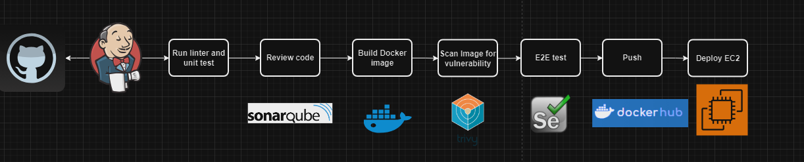

# Jenkins Pipeline for CI/CD

This project intends to demonstrate how to use Jenkins as a CI/CD tool combined with AWS. 

## Tools used
1. Github.
2. Jenkins.
3. Flake8.
4. SonarQube.
5. Docker.
6. Trivy security scanner.
7. DockerHub.
8. SSH keys.

The `Jenkinsfile` describes an automated CI/CD pipeline configured to build, test, scan, and deploy a Dockerized Python web application using Jenkins. Below is a breakdown of each stage and its purpose:

## Pipeline Overview
The pipeline performs the following operations:
1. Linting and unit testing with Python.
2. Checking out the code from Git.
3. Static code analysis using SonarQube.
4. Building and pushing Docker images.
5. Conducting security scans with Trivy.
6. Running containers for end-to-end (E2E) testing with Selenium.
7. Deploying the application to an EC2 instance.

## Pipeline Structure

### Environment Variables
- **IMAGE_NAME**: Name of the Docker image.
- **DOCKER_USER**: Docker Hub username.
- **UNIQUE_TAG**: Unique build tag generated from the Jenkins build number.
- **TRIVY_IMAGE**: Trivy scanner image.
- **SELENIUM_IMAGE**: Selenium image with Chrome for E2E testing.
- **NETWORK_NAME**: Docker network for container communication.
- **TEST_CONTAINER_IMAGE**: Python image for running tests.
- **DOCKERHUB_CREDENTIALS_ID**: Jenkins credentials ID for Docker Hub.

### Stages

#### 1. Lint and Unit Test
- **Agent**: Runs on a Docker container with Python.
- **Steps**:
  - Checks out the code.
  - Installs required Python packages.
  - Lints the code using `flake8`.
  - Runs unit tests with `unittest`.

#### 2. SCM Checkout
- **Steps**:
  - Clones the main branch of the repository using Git.

#### 3. SonarQube Analysis
- **Environment**:
  - Uses SonarQube scanner configured in Jenkins.
- **Steps**:
  - Runs SonarQube analysis to assess code quality.

#### 4. Build Docker Image
- **Steps**:
  - Builds the Docker image and tags it with the unique tag.

#### 5. Trivy Scan
- **Steps**:
  - Runs a security scan on the Docker image using Trivy.

#### 6. Setup Network and Run Containers
- **Steps**:
  - Creates a Docker network if it doesn't already exist.
  - Stops and removes any existing containers named `myapp` and `selenium`.
  - Runs the application container and Selenium container.

#### 7. End-to-End Testing with Selenium
- **Steps**:
  - Creates a directory for test reports.
  - Runs a container for E2E tests using `pytest` and Selenium WebDriver, with results stored as JUnit XML.

#### 8. Tear Down Containers
- **Steps**:
  - Stops and removes `myapp` and `selenium` containers.
  - Removes the Docker network.

#### 9. Push to Docker Hub
- **Steps**:
  - Logs in to Docker Hub using credentials stored in Jenkins.
  - Pushes the built Docker image to Docker Hub and tags it as `latest`.

#### 10. Deploy to EC2
- **Steps**:
  - Connects to an EC2 instance via SSH.
  - Pulls the latest Docker image, stops any running `myapp` container, and deploys the new version.

## Prerequisites
- **Jenkins Plugins**: Docker Pipeline, SSH Agent, SonarQube Scanner.
- **Credentials**:
  - Docker Hub credentials (`dockerhub`).
  - SonarQube token (`sonartoken`).
  - SSH key for EC2 (`sshec2`).

## Usage
1. Ensure all required tools and plugins are installed on Jenkins. (Docker plugin, Docker Pipeline, SSH2 Easy Plugin, SonarQube Scanner for Jenkins).
2. Set up an agent with label `linux` with Git and Docker installed.
3. Set up a SonarQube server `docker run -dit --name sonarqube -p 9000:9000 -p 9092:9092 sonarqube:10.6-community` and configure a project.
4. Update `sonar-project.properties` with project data from before step.
5. Set up the credentials in Jenkins for DockerHub, SonarQube server and EC2 access (with ssh private key).
6. Configure SonarQube in Jenkins.
7. Run the pipeline to automate the CI/CD workflow for the Python web application.

## Notes
- The pipeline assumes a network is needed for communication between `myapp` and Selenium for testing.
- Adjust environment variables as necessary for your project.
- Ensure Docker and Docker Compose are installed on all Jenkins agents used for this pipeline.

## Troubleshooting
- **Container Issues**: Check if containers are properly stopped and removed in the `Tear Down Containers` stage.
- **EC2 Deployment**: Ensure EC2 has access to Docker and the appropriate ports are open in the security group. For this you can use the CloudFormation template at 
  [CloudFormation snippets ](https://github.com/lroquec/cfn-snippets.git)

The `Jenkinsfile` facilitates efficient and secure deployment with thorough testing and code analysis, enabling streamlined CI/CD practices.

